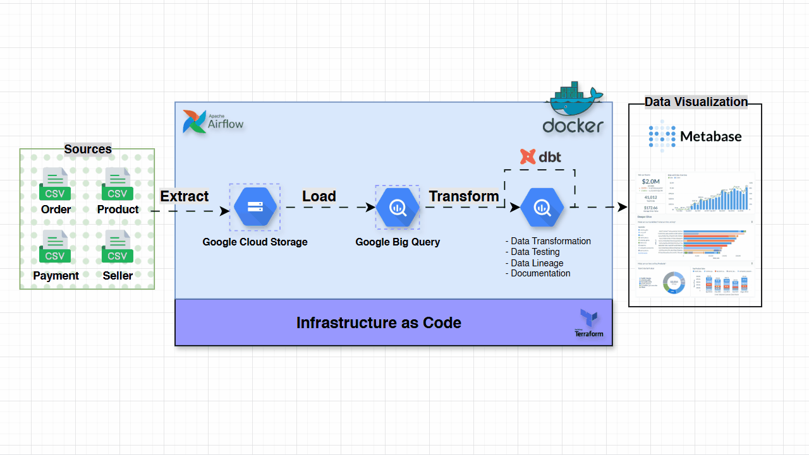
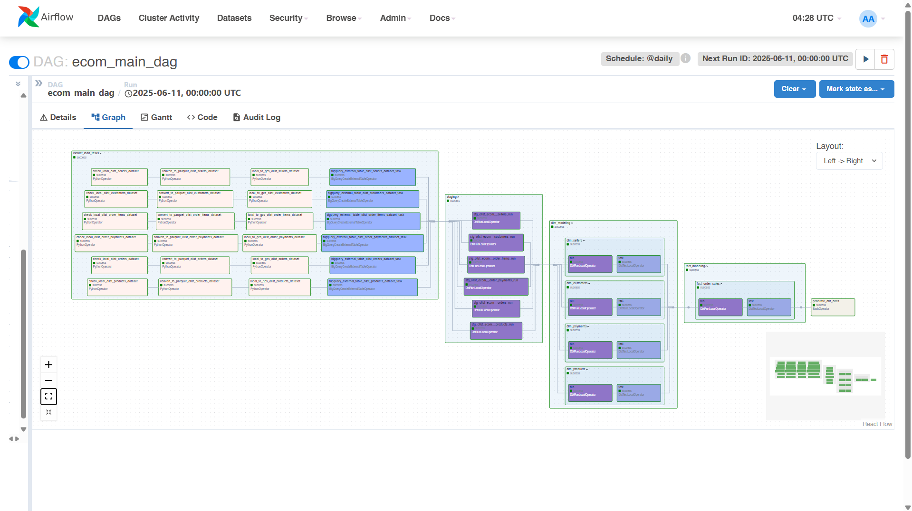
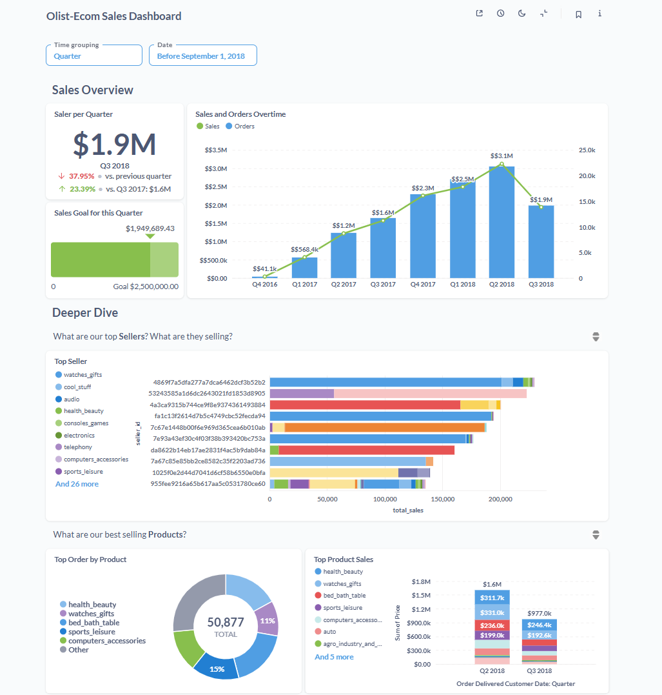

# Olist E-Commerce ELT Pipeline
## 📦 Dataset Background
Olist E-Commerce
Olist is a Brazilian e-commerce marketplace that connects small businesses to major marketplaces, enabling them to sell their products online across Brazil. The dataset used in this project originates from a public version made available for analytics and data science experimentation.

The dataset includes detailed information from over 100,000 orders placed between 2016 and 2018, including:

- Seller performance
- Customer profiles
- Product details
- Order timelines (purchase, payment, shipping)
- Reviews and ratings
- Geolocation data (states and cities)
- Marketing channel performance

This rich dataset allows for seller dynamics, comprehensive analysis across customer behavior, logistics, marketing efficiency. 

But in this case I will focus more on seller dynamic.

You can access the original dataset here: https://www.kaggle.com/datasets/olistbr/brazilian-ecommerce


## Project Overview
- Extract: Raw data is pulled from CSV files and stored in Google Cloud Storage.
- Load: Airflow DAGs load the raw data into staging tables in Google BigQuery.
- Transform: dbt (data build tool) transforms data from staging to analytics-ready marts.
- Visualize: Metabase connects to BigQuery to visualize business insights.

The entire workflow is managed as Infrastructure as Code using Docker and Docker Compose.



## Getting Started

### 1. Clone Repository
```bash
git clone https://github.com/fachry-isl/olist-elt-pipeline.git
```


### 2. Cloud Service Provisioning
#### 2.1 Get Google Account Credential
For interacting with google cloud you need google application credential.
Detailed info is available here [link](https://developers.google.com/workspace/guides/create-credentials)


#### 2.2 Terraform
After getting your google_credentials.json file put it on your home directory `~/.google/credentials/` or somewhere accessible.

And put the path in your `variables.tf` file:

```
variable "credentials"{
    description = "The path to the service account key file"
    default     = [Your Credential PATH]
}
```
Also put your project name

```
variable "project" {
  description = "Project"
  default     = "gcp-refresh-2025"
}
```

#### 2.2.1 Run Terraform Build
```
cd terraform
terraform apply
```


### 2. Setup Environment Variable
Define variable on docker-compose.yaml or .env file.

Example:
```yaml
GOOGLE_APPLICATION_CREDENTIALS: /.google/credentials/google_credentials.json
GCP_PROJECT_ID: 'gcp-refresh-2025' # Replace with your project_id
GCP_GCS_BUCKET: 'gcp-refresh-2025-olist-ecom' # Replace with your GCS bucket name
BIGQUERY_DATASET: 'olist_ecom_all' # Replace with your Bigquery dataset name
```


### 3. Build and Run Docker Container
```bash
docker-compose up --build
```

### Setup Preview
#### Airflow
Airflow is used to orchestrate the full ELT pipeline:

- Extract from CSV
- Load to GCS and BigQuery
- Transform with dbt

#### Airflow and DBT Integration using Cosmos
DBT allows for transformation using Dimensional Modeling (Star Schema). Features:

- Fact and Dimension tables
- Data quality checks (unique, not_null, etc.)
- Auto-generated documentation

Cosmos integrates DBT directly with Airflow for streamlined observability and DAG management.




#### Visualization using Metabase
- Metabase is used as the BI layer to explore and visualize insights from the analytics data mart in BigQuery.


##### 📊 1. Sales Performance Overview (Q3 2018):
- Total Sales: $1.9M – down 37.95% from the previous quarter (Q2 2018) and 23.39% lower than Q3 2017.
- Target vs Actual: Only ~78% of the $2.5M sales goal has been achieved this quarter.

- Orders & Sales Trend:
    - Sales and order volumes peaked in Q2 2018 (~$3.1M), but both dropped significantly in Q3 2018.
    - This signals a potential seasonality or operational issue causing the dip.

##### 🛍️ 2. Top Sellers & Categories:
Leading Sellers:
    - Categories like watches_gifts, cool_stuff, and audio dominate in total sales.
    - Individual sellers within these categories contributed significantly to the sales figures.

##### 📦 3. Product-Level Insights:
Top Ordered Product: Health & Beauty – with 15% of all orders (50,877 total orders).

- Top Revenue Products:
    - Health_beauty: $1.8M (Q2), $1.6M (Q3)
    - Watches_gifts: $311k (Q2), dropped to $192k in Q3
    - Other categories like bed_bath_table and sports_leisure also saw revenue decline in Q3.


